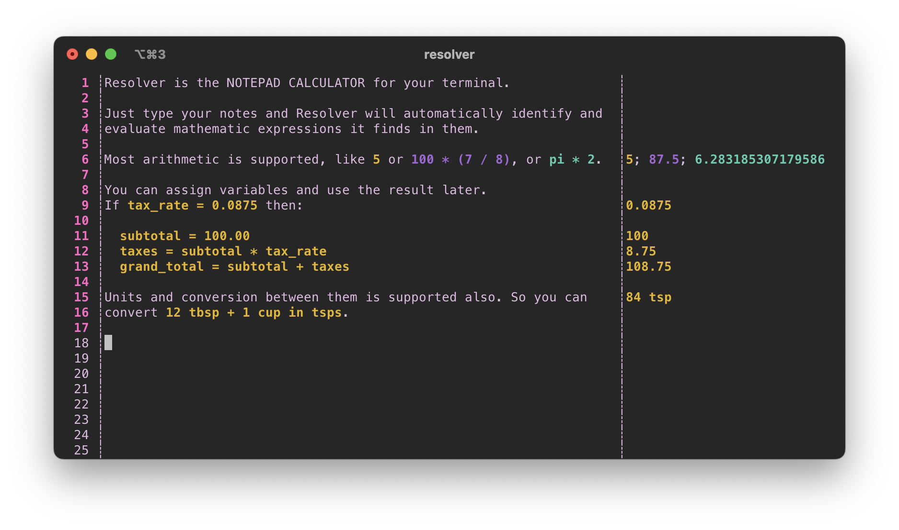

# Resolver
_Resolver_ is the notepad app for your terminal. It takes inspiration from [Soulver](https://soulver.app/), an excellent Mac GUI app that, unfortunately, doesn't work anywhere else.



## Using Resolver
Resolver is currently in development and it has a lot of rough edges. Many of the basics work reasonably well, but if you're inclined to try it out, your expectations should be low.

To run Resolver, build it from source. A recent Rust toolchain is required.

```
$ cargo run
```
